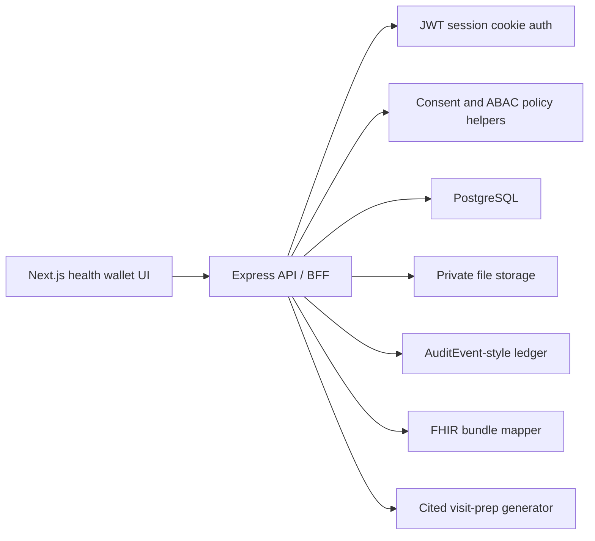

# LifeLedger Architecture

## System Shape



Blockchain and IPFS are removed. The backend does not expose `/uploads`, does not return raw file paths, and does not have blockchain routes.

## Backend Modules

- `config/env.ts`: fail-closed environment validation.
- `db/migrations`: explicit SQL migrations.
- `domain/policy.ts`: shared access decisions for roles, grants, scopes, and expiry.
- `services/fileStorage.ts`: private file save/resolve with MIME and file-signature checks.
- `services/auditService.ts`: central audit event writer.
- `services/fhirMapper.ts`: FHIR-style export mapper.
- `routes/*`: small route modules for auth, profile, records, clinical entries, consents, emergency, FHIR, audit, AI, and admin.

## Data Model

PostgreSQL is the source of truth:

- `users`: patient, doctor, and admin accounts.
- `patient_profiles`: emergency summaries, blood type, directives.
- `provider_profiles`: organization, specialty, verification status.
- `emergency_contacts`: patient-managed contacts.
- `records`: private file metadata and `DocumentReference` data.
- `clinical_entries`: structured allergies, meds, observations, conditions, and other clinical facts.
- `consents`: scoped, expiring access grants and pending requests.
- `emergency_tokens`: expiring QR packet tokens.
- `audit_events`: who accessed what, when, why, and from where.
- `ai_insights`: cited visit-prep summaries with review status.

## Access Model

Patients can access their own data. Admins can access compliance views. Doctors need an active consent grant with the required scope.

Examples:

- A doctor with `labs` can view lab observations but not medication data.
- Expired or revoked grants fail.
- Normal consent requests cannot self-approve as emergencies.
- Emergency QR packets only expose emergency-safe scopes.
- Break-glass access requires a reason and creates a short-lived grant.

## File Storage

The MVP uses local private storage with random storage keys. In production, this service should be swapped for S3/R2/GCS with:

- KMS envelope encryption.
- Antivirus scanning.
- Object lifecycle and retention policies.
- Signed URLs after authorization.
- Download audit events.

## AI Boundary

AI output is limited to source-cited record organization and visit prep. It is not diagnosis, treatment advice, or a medication-change engine.

Future AI work should add:

- Background jobs.
- Structured output validation.
- Prompt-injection tests.
- Source-span citations.
- Human confirmation before clinical facts are saved.
- Model/version traceability.

## Frontend

The frontend is a single operational dashboard with role switching:

- Patient wallet: timeline, consent center, emergency card, FHIR export.
- Doctor workspace: consented data view and cited visit prep.
- Admin console: compliance signals, provider review, audit posture.

The first screen is the app itself, not a marketing landing page.

## Verification Gates

CI runs:

```bash
npm ci
npm run typecheck
npm run lint
npm run test
npm run build
```

Local security hygiene:

```bash
npm audit --omit=dev
```
